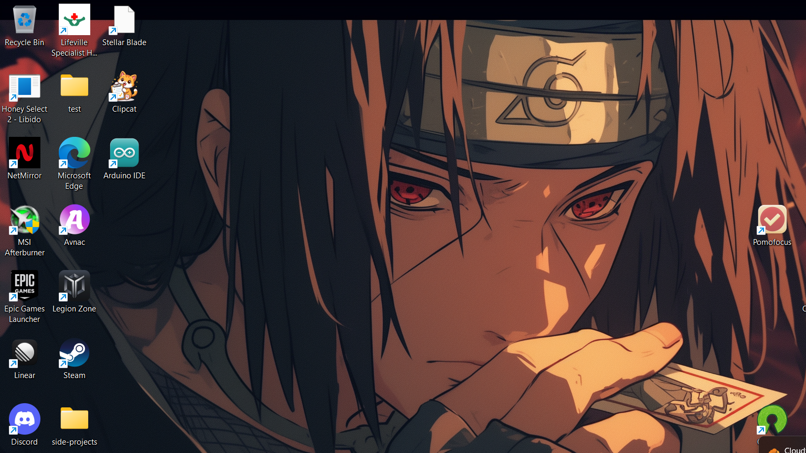

<div align="center">
    
    <h1>Ya - CLI</h1>
    <p>Run your commands. Right now.</p>
</div>


A lightweight command-line shortcut manager. Save long commands under short names and run them instantly — from the terminal or the built-in full-screen TUI.

**"Ya"** comes from the Spanish word meaning "right now."

---

## Download

| Platform | |
|----------|-|
| 🪟 Windows | [](https://github.com/d3uceY/Ya-CLI/releases/latest) |
| 🍎 macOS | [](https://github.com/d3uceY/Ya-CLI/releases/latest) |
| 🐧 Linux | [](https://github.com/d3uceY/Ya-CLI/releases/latest) |

> Or install with Homebrew: `brew tap d3uceY/homebrew-ya && brew install ya`

---

## TUI

Run `ya` with no arguments to open the interactive TUI.



Browse, search, run, and manage shortcuts without typing subcommands.

| Key | Action |
|-----|--------|
| `↑` `↓` / `j` `k` | Navigate |
| `Enter` | Run selected shortcut |
| `/` | Search |
| `a` `e` `r` `d` | Add / Edit / Rename / Delete |
| `p` | Pin / unpin |
| `h` | Run history |
| `D` | Saved directories |
| `?` | Help |
| `q` | Quit |

---

## CLI Quick Reference

```bash
ya                          # open TUI
ya <shortcut>               # run a shortcut
ya add <name> '<command>'   # add a shortcut
ya remove <name>            # delete a shortcut
ya rename <old> <new>       # rename a shortcut
ya list                     # list all shortcuts
ya search <term>            # search by name or command
ya show <name>              # show a shortcut's command
ya import <file>            # import from JSON
ya export <dir>             # export to JSON
ya version                  # show version
```

### Template values

Add `{placeholder}` tokens to any command — Ya prompts you to fill them in at runtime:

```bash
ya add commit 'git commit -m {message}'
ya commit
# → [1/1] message: fix login bug
```

### Extra arguments

Pass additional args when running a shortcut — they're appended to the command:

```bash
ya gcm -m "Initial commit"   # runs: git commit -m 'Initial commit'
```

---

## Shell Tab-Completion

One-time setup to tab-complete shortcut names:

```powershell
# PowerShell
ya completion powershell >> $PROFILE ; . $PROFILE
```
```bash
# Bash
echo 'source <(ya completion bash)' >> ~/.bashrc && source ~/.bashrc
```
```zsh
# Zsh
echo 'source <(ya completion zsh)' >> ~/.zshrc && source ~/.zshrc
```
```fish
# Fish
ya completion fish > ~/.config/fish/completions/ya.fish
```

---

## Data

Shortcuts, history, and config are stored in your user config directory and **shared with [Ya-GUI](https://github.com/d3uceY/Ya-GUI)**:

- Windows: `%APPDATA%\ya\data\`
- macOS: `~/Library/Application Support/ya/data/`
- Linux: `~/.config/ya/data/`

---

## GUI Companion


[Ya-GUI](https://github.com/d3uceY/Ya-GUI) is a desktop app that reads and writes the same files. Anything you create in the CLI or TUI is immediately available in the GUI, and vice versa.

---

## License

MIT — see [LICENSE](LICENSE).

## Contributing

See [CONTRIBUTING.md](CONTRIBUTING.md) for build instructions, project structure, and how to submit changes.

